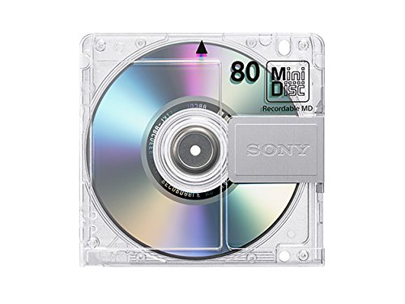

<!DOCTYPE html>
<html lang="en">
    <head>
        <title>Audio Devices</title>
    </head>
    <section>
        
Audio players from the 2000s

    </section>
    <article>
        
There are many players that you can use to listen to music. I prefer using Minidiscs and CD players.

        
Minidiscs are a format created by Sony that committed audio to a 4 inch disc with a hard shell. This could hold about an albums worth of music in a small form factor, so its good for on the go listening.

        
CDs are a little bigger than minidisc, but are more consistent with audio playback. They are the industry standard for music playback.

        
    <aside>
        
There are many other players that you can use to listen to music. Cassettes and record players are also a good choice.

        
Cassettes are good for bringing your music with you, but having multiple cassettes just to listen to different artists throughout your day is a bit cumbersome.

        
Likewise, vinyl records are good for if you want to play your music in the background and have it be secondary to your activities. They also provide a higher quality analog listening experience

    </aside>
</html>
